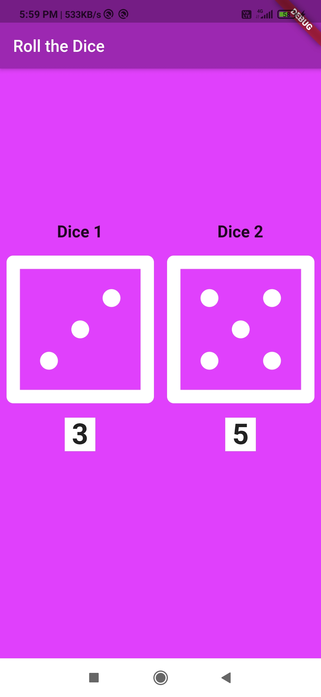
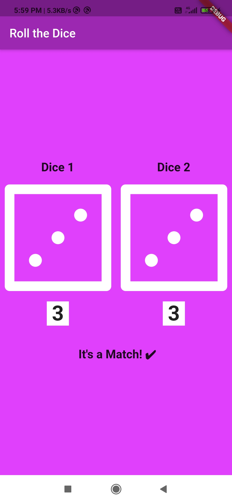

# Dicee 🎲

## Our Goal

The objective of this tutorial is to introduce you to the core programming concepts that will form the foundation of most of the apps you’ll build in the future. This app will teach you how to make apps with functionality using setState() inside Stateful Flutter widgets.

## What you will create

We’re going to make a Las Vegas dice app. You can make the die roll at the press of a button. With this app in your pocket, you’ll be able to settle any score on the go!

# My alteration!

## Screenshot

<table>
	<tr>
		<td>
			
		</td>		
		<td>
			
		</td>		
	</tr>
	<tr>
		<td>
			<h1 align="center" >Shot 1</h1>			
		</td>		
		<td>
			<h1 align="center" >Shot 2</h1>
		</td>		
	</tr>
</table>

